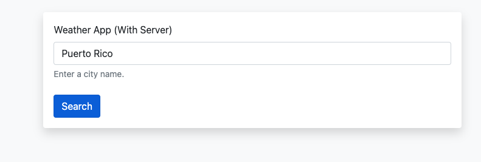
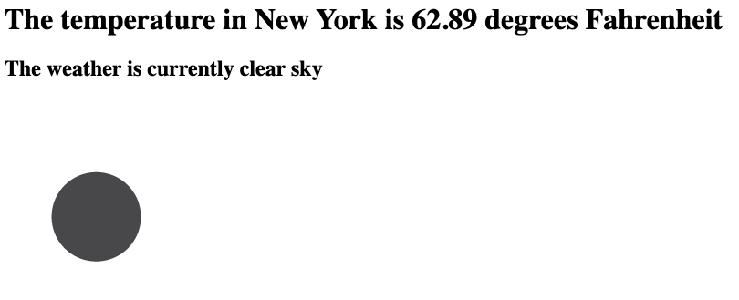

# express-server-weather-app

### References

1. [Open Weather Map]()
2. [Postman](https://www.postman.com/)

---

### App Images
##### On Start


### After search


---

### Topics Covered

1. Making GET Request with Node HTTPS Module
2. Using Express to Render a Website with Live API Data

---

### Making GET Request with Node HTTPS Module

### `Step 1`

Create variable to hold native https library
* HTTPS is a native module
* Making a get request across the internet using the HTTP protocol

```javascript
const https = require("https");
```

### `Step 2`

Call `https.get()`

```javascript
app.get("/", function(req, res){

    const url = "https://api.openweathermap.org/data/2.5/weather";

    //
    https.get(url, function(response){
        console.log(response.statusCode)
    })


    res.sendFile(__dirname + "/index.html");
})
```

### `Step 3`

Use response.on() to get data

```javascript
// Fetch from external server
    https.get(url, function(response){
        console.log(response.statusCode)

        response.on("data", function(data){

            // Convert data from HEX to JSON
            const weatherData = JSON.parse(data)

            // Collect data of interest
            const temp = weatherData.main.temp;
            const feelsLike = weatherData.main.feels_like;
            const weatherDescription = weatherData.weather[0].description;
            
            // Response to give the browser
            res.send("<h1>The temperature in New York is " + temp + " degrees Fahrenheit</h1>")
        })
    })
```