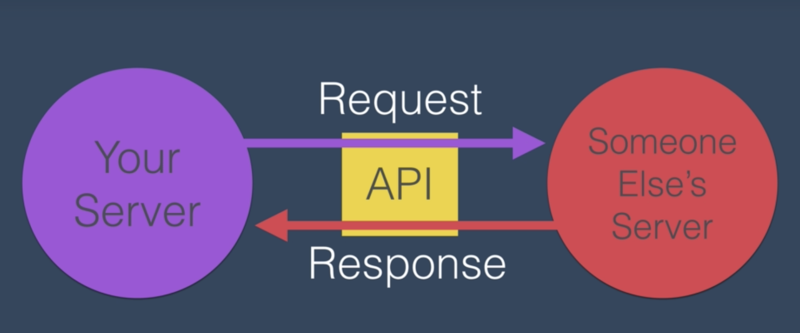

# express-server-weather-app

### References

### Topics Covered

1. APIs
2. API endpoint, paths, and parameters
3. API Authentication and Postman

### API's

An Application Programming Interface (API) is a set of commands, functions, protocols, and objects that programmers can use to create software or interface with an external system.

* Allows developers to access certain data.

* Gives developers functions, protocols, etc, things to use to access that data.

* Programmers use APIs to create software or interact with an external system.

### API endpoint, paths, and parameters

Endpoint - Every API that interacts with external systems, like a server, will have an endpoint.

Paths | Parameters - use in order to narrow down on a specific piece of data you want to use from an external server. Through the use of path and parameters you can get what data you want from the API.
* Parameters go at the end of a URL after a question mark
* Parameters have key value pairs: example `?contains=debugging`
* You can enter multiple parameters.
* Ampersand - & - separates key value pairs

### API Authentication and Postman

Authentication | Postman -